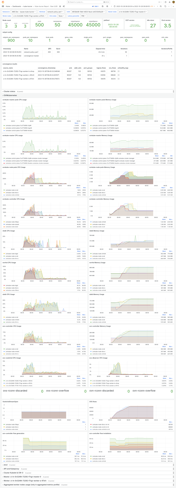

## Intro

network-policy workload is used to generate a large number of non-trivial network policies.
The workload is defined in [./network-policy.yaml](./network-policy.yaml) and consists of
- `convergence-tracker` job: these are the pods that should track when the created objects are applied.
- `network-policy-perf` job: this job creates the workload after `convergence-tracker` resources are created.

## Workload details

`network-policy-perf` job creates a given number of namespaces named `network-policy-perf-<iteration>` (iteration starts form 0) with the same contents.
Every namespace has a given number of pods named `test-pod-<replica>` (replica starts from 1) based on [./templates/pod.yml](pod.yml).
Every pod is labeled with `1: "true", ..., <replica>: "true` to select the required number of pods in the future.
`test-pod: "true"` label is added for `podAntiAffinity` to spread the workload pods as evenly as possible across the nodes.
Network policy always selects first N pods by pod selector, therefore we add `num=<replica>` label to ensure
equal distribution of selected pods.

```
kubectl get pods -n network-policy-perf-0 --show-labels
NAME         READY   STATUS    RESTARTS   AGE     LABELS
test-pod-1   1/1     Running   0          2m52s   1=true,kube-burner-index=0,kube-burner-job=network-policy-perf,kube-burner-runid=4310adad-84eb-4d5b-a984-f408b2b1cd4e,kube-burner-uuid=106b3aff-4b90-4e0d-b69f-495e9f24e8d5,num=1,test-pod=true
test-pod-2   1/1     Running   0          2m52s   1=true,2=true,kube-burner-index=0,kube-burner-job=network-policy-perf,kube-burner-runid=4310adad-84eb-4d5b-a984-f408b2b1cd4e,kube-burner-uuid=106b3aff-4b90-4e0d-b69f-495e9f24e8d5,num=2,test-pod=true
test-pod-3   1/1     Running   0          2m52s   1=true,2=true,3=true,kube-burner-index=0,kube-burner-job=network-policy-perf,kube-burner-runid=4310adad-84eb-4d5b-a984-f408b2b1cd4e,kube-burner-uuid=106b3aff-4b90-4e0d-b69f-495e9f24e8d5,num=3,test-pod=true
```

Every namespace has a given number of network policies named `ingress-<idx>` and `egress-<idx>` (idx starts form 0)
based on [./templates/ingress-np.yml](ingress-np.yml) and [./templates/egress-np.yml](egress-np.yml),
corresponding ingress and egress policies have exactly same peers for now (may be changed in the future).

Networkpolicy template takes the following args:
- local_pods: number of pods to select by `spec.podSelector`, same set of pods for every policy in the namespace
- single_ports: number of single ports for every gress rule
- port_ranges: number of port ranges for every gress rule
- pod_selectors: number of selector-based gress rules, every rule has only 1 selector and may have multiple ports
- peer_namespaces: number of selected namespaces for every pod_selector peer
- peer_pods: number of selected pods for every pod_selector peer
- cidr_rules: number of CIDR-based gress rules

To increase the real load and reduce the number of possible internal optimizations, we need to generate different peers.
CIDRs are all different inside one namespace, they start from `1.0.0.0/24`, and are incremented by 1, `1.0.1.0/24`, `1.0.2.0/24, etc.
Peer selectors always select the same pods based on the required number, but always have different namespace selectors.
We have BinomialCoefficient(NAMESPACES, PEER_NAMESPACES) different peer namespace sets, which don't repeat across network policies
and namespace unless we have more selector-based rules. 

Example: if we have 5 namespaces and every policy selects 3 namespaces for every peer, we have BinomialCoefficient(5, 3) = 10, 
which gives the following choices (think peer namespace indexes):

[1] 1,2,3\
[2] 1,2,4\
[3] 1,2,5\
[4] 1,3,4\
[5] 1,3,5\
[6] 1,4,5\
[7] 2,3,4\
[8] 2,3,5\
[9] 2,4,5\
[10] 3,4,5

If we create 5 namespaces with 1 network policy each and 2 peer selector with 3 peer_namespaces, we will have

ns1.np1.peer1 selects namespaces 1,2,3 [1]\
ns1.np1.peer2 selects namespaces 1,2,4 [2]\
ns2.np1.peer1 selects namespaces 1,2,5 [3]\
ns2.np1.peer1 selects namespaces 1,3,4 [4]\
...\
ns5.np1.peer1 selects namespaces 2,4,5 [9]\
ns5.np1.peer1 selects namespaces 3,4,5 [10]

<details>
  <summary>In the cluster it will look like (ingress-only)</summary>

```
items:
- apiVersion: networking.k8s.io/v1
  kind: NetworkPolicy
  metadata:
    creationTimestamp: "2023-08-23T09:35:39Z"
    generation: 1
    labels:
      kube-burner-index: "1"
      kube-burner-job: network-policy-perf
      kube-burner-runid: 39baa8cb-07c6-441f-add6-07a56404a14b
      kube-burner-uuid: 9c3cdf2e-4fd7-470a-b1b0-2d1c1a7b5c32
    name: ingress-1
    namespace: network-policy-perf-0
    resourceVersion: "66063"
    uid: 5abd93b5-906e-44e0-be1f-1be30b6bbeed
  spec:
    ingress:
    - from:
      - namespaceSelector:
          matchExpressions:
          - key: kubernetes.io/metadata.name
            operator: In
            values:
            - network-policy-perf-1
            - network-policy-perf-2
            - network-policy-perf-3
        podSelector:
          matchLabels:
            "1": "true"
    - from:
      - namespaceSelector:
          matchExpressions:
          - key: kubernetes.io/metadata.name
            operator: In
            values:
            - network-policy-perf-1
            - network-policy-perf-2
            - network-policy-perf-4
        podSelector:
          matchLabels:
            "1": "true"
    podSelector:
      matchLabels:
        "1": "true"
    policyTypes:
    - Ingress
  status: {}
- apiVersion: networking.k8s.io/v1
  kind: NetworkPolicy
  metadata:
    creationTimestamp: "2023-08-23T09:35:39Z"
    generation: 1
    labels:
      kube-burner-index: "1"
      kube-burner-job: network-policy-perf
      kube-burner-runid: 39baa8cb-07c6-441f-add6-07a56404a14b
      kube-burner-uuid: 9c3cdf2e-4fd7-470a-b1b0-2d1c1a7b5c32
    name: ingress-1
    namespace: network-policy-perf-1
    resourceVersion: "66068"
    uid: f5f26105-125b-4436-8a97-3d2fdace15bb
  spec:
    ingress:
    - from:
      - namespaceSelector:
          matchExpressions:
          - key: kubernetes.io/metadata.name
            operator: In
            values:
            - network-policy-perf-1
            - network-policy-perf-2
            - network-policy-perf-5
        podSelector:
          matchLabels:
            "1": "true"
    - from:
      - namespaceSelector:
          matchExpressions:
          - key: kubernetes.io/metadata.name
            operator: In
            values:
            - network-policy-perf-1
            - network-policy-perf-3
            - network-policy-perf-4
        podSelector:
          matchLabels:
            "1": "true"
    podSelector:
      matchLabels:
        "1": "true"
    policyTypes:
    - Ingress
  status: {}
- apiVersion: networking.k8s.io/v1
  kind: NetworkPolicy
  metadata:
    creationTimestamp: "2023-08-23T09:35:39Z"
    generation: 1
    labels:
      kube-burner-index: "1"
      kube-burner-job: network-policy-perf
      kube-burner-runid: 39baa8cb-07c6-441f-add6-07a56404a14b
      kube-burner-uuid: 9c3cdf2e-4fd7-470a-b1b0-2d1c1a7b5c32
    name: ingress-1
    namespace: network-policy-perf-2
    resourceVersion: "66071"
    uid: e74b9e03-311c-4dcb-b1f1-22424ace949d
  spec:
    ingress:
    - from:
      - namespaceSelector:
          matchExpressions:
          - key: kubernetes.io/metadata.name
            operator: In
            values:
            - network-policy-perf-1
            - network-policy-perf-3
            - network-policy-perf-5
        podSelector:
          matchLabels:
            "1": "true"
    - from:
      - namespaceSelector:
          matchExpressions:
          - key: kubernetes.io/metadata.name
            operator: In
            values:
            - network-policy-perf-1
            - network-policy-perf-4
            - network-policy-perf-5
        podSelector:
          matchLabels:
            "1": "true"
    podSelector:
      matchLabels:
        "1": "true"
    policyTypes:
    - Ingress
  status: {}
- apiVersion: networking.k8s.io/v1
  kind: NetworkPolicy
  metadata:
    creationTimestamp: "2023-08-23T09:35:39Z"
    generation: 1
    labels:
      kube-burner-index: "1"
      kube-burner-job: network-policy-perf
      kube-burner-runid: 39baa8cb-07c6-441f-add6-07a56404a14b
      kube-burner-uuid: 9c3cdf2e-4fd7-470a-b1b0-2d1c1a7b5c32
    name: ingress-1
    namespace: network-policy-perf-3
    resourceVersion: "66079"
    uid: c1c3b966-390c-4c44-8fc9-c106fb036e64
  spec:
    ingress:
    - from:
      - namespaceSelector:
          matchExpressions:
          - key: kubernetes.io/metadata.name
            operator: In
            values:
            - network-policy-perf-2
            - network-policy-perf-3
            - network-policy-perf-4
        podSelector:
          matchLabels:
            "1": "true"
    - from:
      - namespaceSelector:
          matchExpressions:
          - key: kubernetes.io/metadata.name
            operator: In
            values:
            - network-policy-perf-2
            - network-policy-perf-3
            - network-policy-perf-5
        podSelector:
          matchLabels:
            "1": "true"
    podSelector:
      matchLabels:
        "1": "true"
    policyTypes:
    - Ingress
  status: {}
- apiVersion: networking.k8s.io/v1
  kind: NetworkPolicy
  metadata:
    creationTimestamp: "2023-08-23T09:35:39Z"
    generation: 1
    labels:
      kube-burner-index: "1"
      kube-burner-job: network-policy-perf
      kube-burner-runid: 39baa8cb-07c6-441f-add6-07a56404a14b
      kube-burner-uuid: 9c3cdf2e-4fd7-470a-b1b0-2d1c1a7b5c32
    name: ingress-1
    namespace: network-policy-perf-4
    resourceVersion: "66086"
    uid: db941c7d-e6a7-48db-8575-3d2a3da6f2bf
  spec:
    ingress:
    - from:
      - namespaceSelector:
          matchExpressions:
          - key: kubernetes.io/metadata.name
            operator: In
            values:
            - network-policy-perf-2
            - network-policy-perf-4
            - network-policy-perf-5
        podSelector:
          matchLabels:
            "1": "true"
    - from:
      - namespaceSelector:
          matchExpressions:
          - key: kubernetes.io/metadata.name
            operator: In
            values:
            - network-policy-perf-3
            - network-policy-perf-4
            - network-policy-perf-5
        podSelector:
          matchLabels:
            "1": "true"
    podSelector:
      matchLabels:
        "1": "true"
    policyTypes:
    - Ingress
  status: {}

```

</details>

<details>
    <summary>env</summary>

```
NAMESPACES=5
PODS_PER_NAMESPACE=1
NETPOLS_PER_NAMESPACE=1

LOCAL_PODS=1
SINGLE_PORTS=0
PORT_RANGES=0
POD_SELECTORS=2
PEER_NAMESPACES=3
PEER_PODS=1
CIDRS=0
```
</details>

## Different Platforms

Different clusters may require different techniques to do the scale testing. While this framework may be used
as it is by any kubernetes cluster, extra features like convergence tracker and metrics may be also enabled.
Since config for these features usually differs based on the network plugin and cluster type, we have added 
`PLATFORM` env variable and corresponding `platfrom_name` folders that may be used as an example by other platforms,
and also may be reused and improved by the same platform as a part of this framework.

Every platform may have its own README.

## Tracking the end of the test

`CONVERGENCE_TRACKER` env variable enables `convergence-tracker` job.
The right way to track convergence may differ based on network plugin or cluster type, you can use existing platforms
as an example.
For example, ovn-kubernetes network plugin uses OVS flows underneath, therefore this job spins up a pod
on every node and tracks the number of OVS flows, when this number stops changing it considers the config to be applied.
There is a `THRESHOLD` parameter that defines for how long it waits to consider the number of flows converged.
`convergence_waiter.sh` is a script that waits for all convergence-tracker pod to be completed, before deleting
the workload.

## Running

1. Install kube-burner v1.9.0+
  
    1.1 You can download kube-burner from https://github.com/cloud-bulldozer/kube-burner/releases
    
    1.2 You can build it from source [kube-burner](https://github.com/cloud-bulldozer/kube-burner/tree/main) with
     `make build`
2. `cd ./kube-burner-workload`
3. Set env variables with the test config in the `env` file\
**NOTE**: some corner cases may not work
4. `source ./env`
5. `kube-burner init -c ./network-policy.yaml`

**Note** Every platform may have its own README with more details

To clean up resources created by this workload run `kubectl delete ns -l kube-burner-job`

## Result

When using metrics collection, you can create a dashboard that will give you details about the test config and 
cluster state during the test, including performance metrics. An example dashboard for `./openshift` profile is


