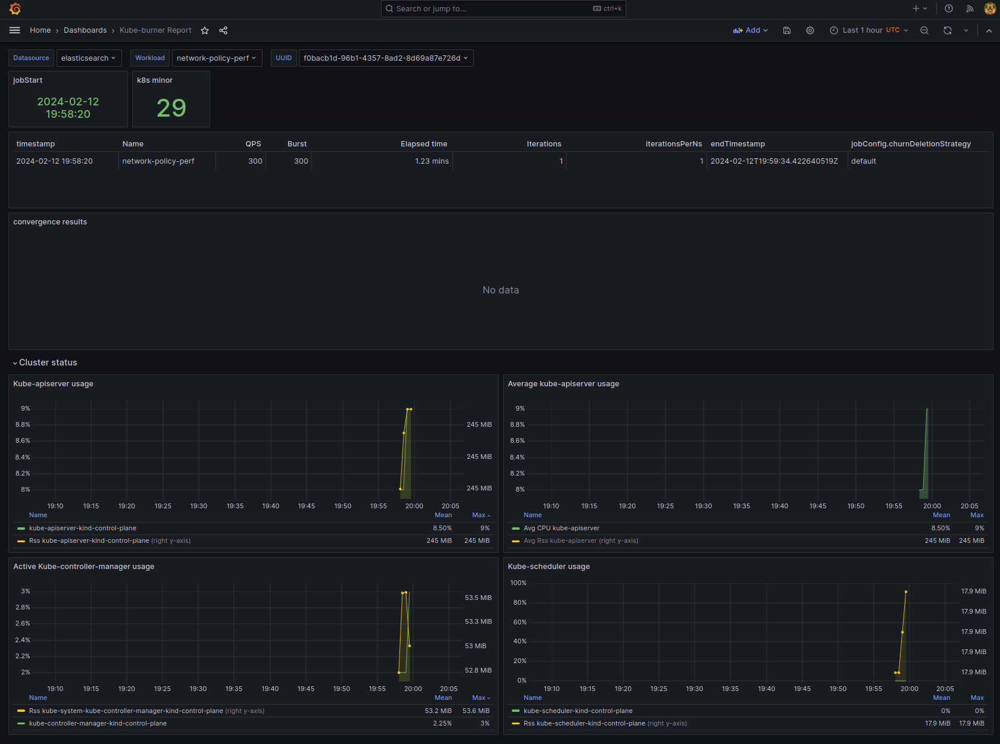

This folder helps you enable metric collection for scale tests.
It consists of the following steps:
1. Install Prometheus in a KinD cluster
2. Run Elasticsearch locally with docker
3. Run Grafana locally with docker
4. Run kube-burner with metrics collection
5. Configure Grafana dashboard to collect data from Elasticsearch


You may have some of the mentioned steps already done, then just replace IPs and ports in the following steps.

1. Install Prometheus in a KinD cluster
`kubectl apply -f monitoring.yaml`
This command will create a monitoring namespace, Prometheus pod and a NodePort service.
You can check Prometheus interface at <prometehus pod's node ip>:<svc port>

2,3. Run Elasticsearch and Grafana locally with docker

To ensure collected data outlives the KinD cluster, we run Elasticsearch and Grafana as external containers.

```shell
docker run -d --name=elasticsearch -p 9200:9200 -e "discovery.type=single-node" -e "xpack.security.enabled=false" docker.elastic.co/elasticsearch/elasticsearch:8.12.1
docker run -d --name=grafana -p 3000:3000 grafana/grafana:latest
```

To get docker container IP, use
`docker inspect -f '{{range.NetworkSettings.Networks}}{{.IPAddress}}{{end}}' <container ID>`

Grafana should be running at localhost:3000, credentials are admin/admin.

4. Run kube-burner with metrics collection

```shell
cd ./kube-burner-workload
source ./env
kube-burner init -m ./kind-metrics/metrics.yml -c ./network-policy.yaml -u http://<prometehus pod's node ip>:<svc port>
```

Wait for kube-burner to finish (takes around 6 minutes, waiting time is configured with JOB_PAUSE).

5. Configure Grafana dashboard to collect data from Elasticsearch

- Log into Grafana (see step 3), go to configure Data Sources (Menu > Connections > Data sources)
- Add data source of type elasticsearch
- Configure

  URL = `http://admin:admin@<elasticsearch container ip>:9200`\
  No Authentication\
  Elasticsearch details >
  - Index name = `kube-burner`
  - Time field name = `timestamp`

- Click `Save & test`, expect "Data source successfully connected."
- Create a dashboard, Menu > Dashboards > New > Import Dashboard
- Import json form [./grafana_dash.json](./grafana_dash.json)

You should see something like 
If not, try to click on UUID dropdown and see if there is something to select.

6. More metrics may be added with e.g. https://github.com/kubernetes/kube-state-metrics
